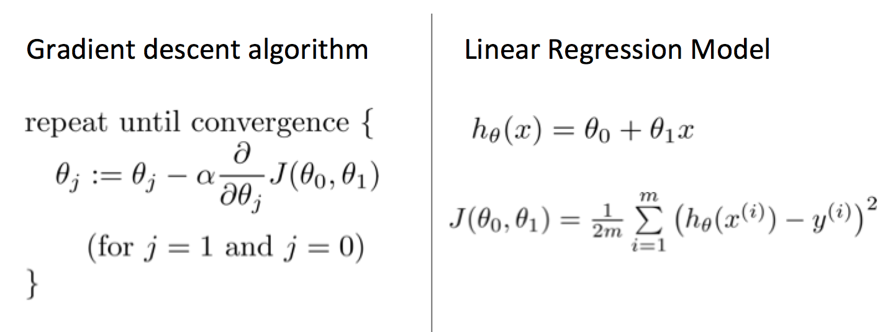

##单一变量的线性回归
### 序
**训练集** ：在监督式学习中，数据集被称为训练集
   
把训练集作为学习算法的输入，算法的输出为一个函数，习惯用h表示（hypothesis），在单一变量的线性回归模型中，h为带有一个变量x的线性函数：

简写为：

### Cost Function
#### 概述
我们的目标是：   
选择合适的和，让尽可能接近y(也即是是前面所述的“right answer”)

把上述目标规范化，其实是一个最小化问题：    
    
解释：
前面加上是为了让计算更加简单

更近一步地，定义：    
    
为代价函数，则我们的目标为：    

这样的代价函数也被称为`squared error function`或`square error cost function`。    
选择这种形式的函数作为代价函数被证明是合理的，并且适合大多数问题，用的也很普遍。当然也有其他形式的代价函数。

#### Cost Function的几何含义
和一确定，就唯一确定了hypothesis，其对应一条直线。我们的目标是找出和，使训练集中的各个点到hypothesis的垂直距离的平方和最小。

### Gradient descent algorithm
梯度下降算法不仅仅用于线性回归，在机器学习中到处都有用到。

可以证明梯度下降法可以用于求解这样的问题。

步骤（不妨假设J有两个自变量）：

- 开始时先猜测和的值（初始值，通常都设为0）
- 不断改变和，来减小J，直到达到一个最小值或极小值

梯度下降算法：    
repeat until convergence {    
	    
	（simultaneously update j=0 and j=1）    
}    
其中： => learning rate，以多快的速率更新，永远为正数

随着越来越接近极小值，其移动的步长也越来越小，从几何上来看，因为其越接近极小值，J的切线斜率越来越接近0。因此无需调整，梯度下降算法也会收敛。

#### 梯度下降法与线性回归结合

虽然梯度下降法中选择不同的初始最终收敛时会得到不同的极小值，但是易证，线性回归的代价函数为一个“碗形”的函数，即凸函数。这种函数有唯一极小值，该极小值也为最小值。

因此，将梯度下降法应用到线性回归的代价函数中，总是能在最小值上收敛。

**“Batch” Gradient Descent**

在梯度下降过程中的每一步，用到了训练集中的全部数据。

#### 补充
- 在解决时，有一种非迭代的算法（如梯度下降）
	- 优点：无需设定学习速率（learning rate）
- Learning with large number of features
	- 最好的方案是——线性代数（linear algebra），矩阵和向量

