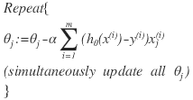

### Cost Function

回顾一下，在Logistic回归中，与线性回归类似，我们已知了其假设函数的形式，要根据训练集确定的参数。那么怎么确定呢？我们是通过代价函数Cost Function。

在线性回归中，我们的代价函数如下所示：

令：

则线性回归的代价函数为：

。

而在Logistic回归中，如果我们用同样的代价函数，由于是一个较为复杂的非线性函数，我们会发现Cost函数不是一个凸函数（non-convex），因此通过梯度下降算法找到的可能不是最小值而是一个局部极小值。

在Logistic回归中采用的Cost Function如下所示：

当y=1时，函数为：

只观察这一个函数，我们可以发现以下规律：

当时，说明做出了精确的预测，此时Cost的值为0；

但是当：时，，因为，也就是说实际的y值为1，结果我们的假设函数做出了0的预测，代价显然是无穷大。

当y=0时，函数图像为：

我们可以发现与y=1时相类似的规律。

### Simplified Cost Function and Gradient Descent

我们可以用一种简单的写法将Logistic回归中的代价函数写成一个（注意在Logistic回归中，y的取值要么是0要么是1）：

因此，Logistic回归的代价函数就可以写为：

回顾一下我们的目标是通过某种方法找到一个，是Cost Function有最小值：

#### 梯度下降算法

在梯度下降算法的基本形式为：

把Logistic回归的代价函数代入上式，通过计算，发现Logistic回归的梯度下降算法最终的计算式与线性回归相同：

那么这么看来Logistic回归与线性回归在应用梯度下降算法上貌似没有区别？

其实不是的，注意，两种回归不一样的地方是，也即假设函数。在梯度下降算法的算式中，虽然形式一模一样，但是在线性回归中，，而在Logistic回归中，，因此，他们梯度下降算法的算式是完全不一样的。

如果我们想在Octave中实现梯度下降，别忘了将其向量化：

最后，在线性回归中应用梯度下降算法时，我们曾经讲过要将各个features的范围调整到差不多的方法，以加快梯度下降算法的收敛，在Logistic回归这里，那些方法同样适用。